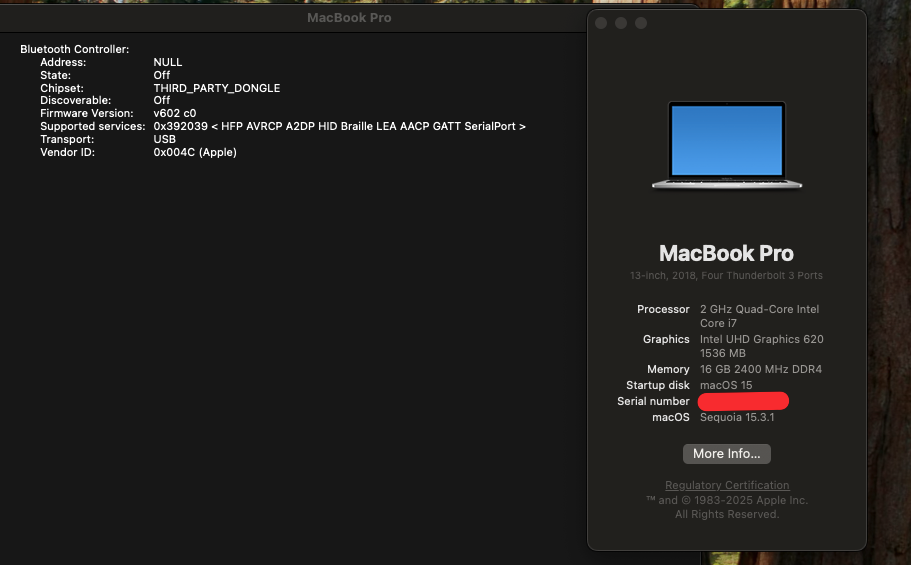

# Hackintosh Sequoia On Asus A442UF

Specs:
- Intel Core i7 8550U
- Nvidia GeForce MX130
- Intel Graphics UHD 620
- ALC256 Codec Audio
- Qualcomm Atheros QCA9377

## Works ✅

- Bluetooth
- Audio
- Hdmi
- USB Port
- Ethernet
- Shutdown, Sleep & Restart
- Camera
- Brightness
- Battery && Power Management

## Not Working ❌
- Internal Wifi, use dongle instead

